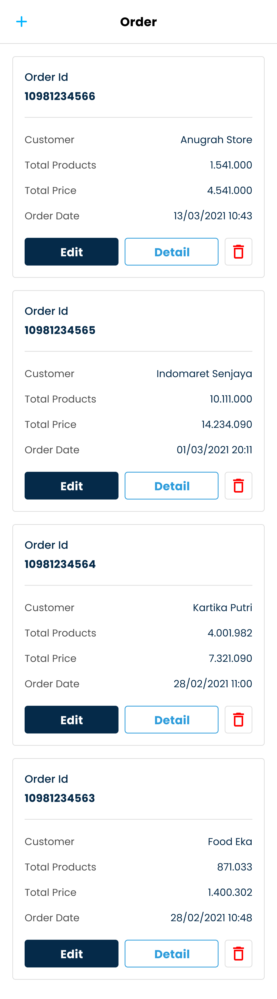
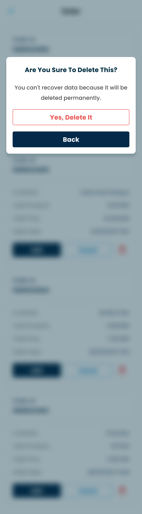
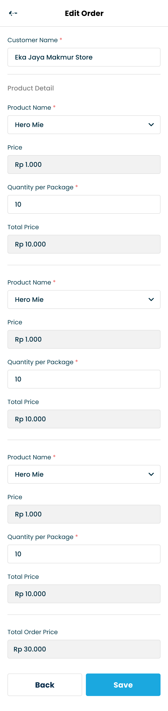
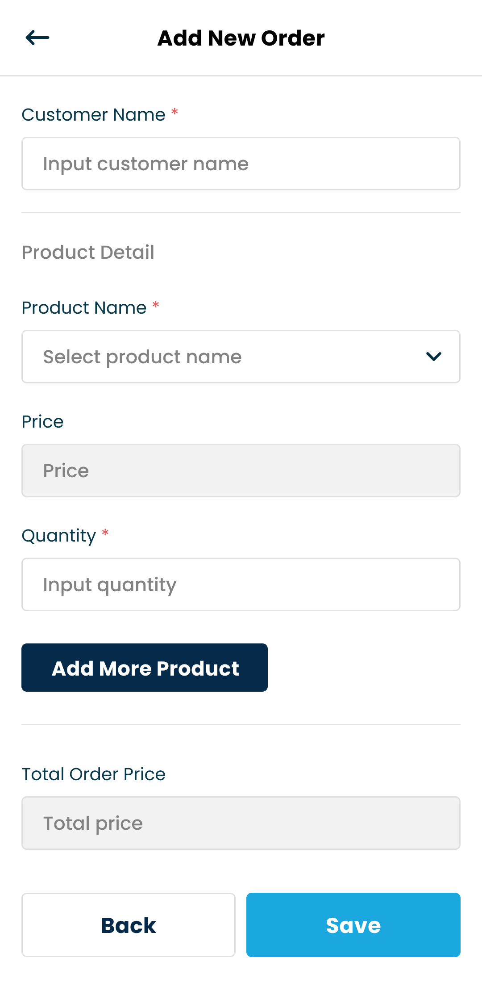
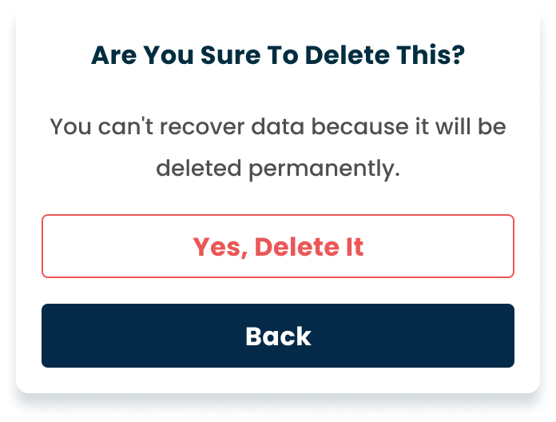
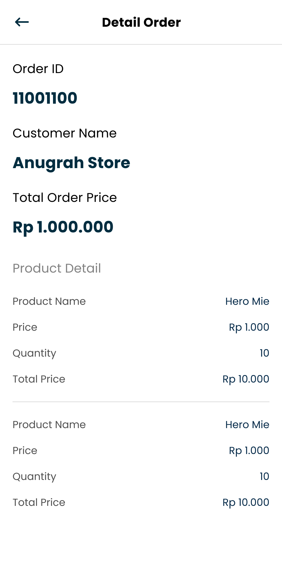

# Order Besar React Native with TypeScript


## Overview
The Order Management App is a mobile application developed using React Native and TypeScript. It is designed to manage and track orders efficiently. The app supports creating, viewing, editing, and deleting orders with features such as endless scroll pagination for order lists, real-time price updates, and detailed order views. The application integrates with a mock API to fetch and manipulate order data.

## Features

### 1. View Order List
- **Paginated List**: View a list of orders with endless scroll functionality for continuous loading.

### 2. Create New Order
- **Product Selection**: Choose a product to display its price.
- **Automatic Price Update**: The total price updates in real-time based on the selected product and quantity.

### 3. Edit an Order
- **Modify Order Details**: Change various details of an order, with the exception of the customer name.

### 4. Delete an Order
- **Confirmation Dialog**: A confirmation dialog is shown before an order is permanently deleted.

### 5. View Order Details
- **Detailed View**: Access and review comprehensive details for each order.


## Built With
-----------
* Programming Language: TypeScript
* Framework: React Native
* Expo: For development environment and project management.
* React Navigation for navigation within the app.

## Technical Requirements
-------------------------
* Expo CLI for project management and running.
* Android Studio / Xcode for simulator/emulator testing.
* Node.js for development environment setup.


## Running the Project with Expo
-------------------------
## Running the Project with Expo

To run the project locally, follow these steps:

1. **Clone the Repository:**
   ```bash
   git clone <repository-url>
   cd <repository-directory>
   ```

2. **Install Dependencies:**
   ```bash
   npm install
   # or
   yarn install
   ```

3. **Start Expo:**
   ```bash
   npx expo start
   # or
   yarn start
   ```

These commands will set up the project on your local machine and start the Expo development server. You can then use Expo Go (on iOS/Android) to view the app on your device or emulator.


### Screenshots

<p align="center">
  
   
  
</p>

<p align="center">
  
  
  
</p>


## Contact
-----------
If you have any questions or feedback regarding this project, please reach out to me through GitHub or email.
